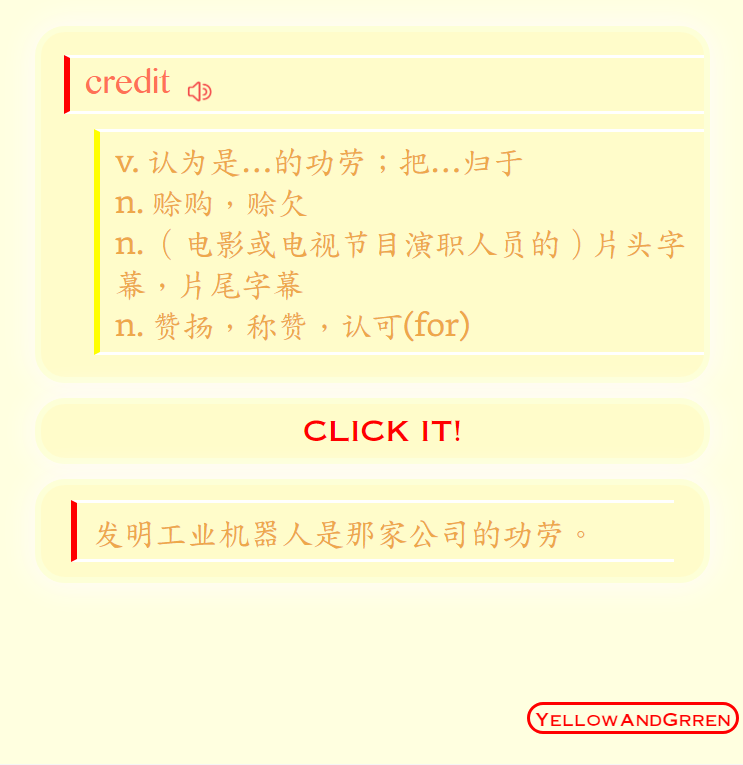

# ANKI_Template

ANKI的语言学习卡片模块，充分使用例句来吸收新词汇。

# Features⭐
+ 实行单词记忆的例句原则，OmniAnki的卡片正面只有英文单词和英文例句，只能通过例句回忆起对应释义。 *根据Anki的简化原则，每张卡片只对应一个释义，即只需要回忆起一个释义即可。*

# Usage🚀
分别复制正面，背面和样式CSS文件到卡片设置的对应文件中即可。

> 特殊字体需要自行下载并复制到ANKI的媒体文件夹中。

**或者：**直接导入`牌组文件.akpg`，相应文件会自动导入，选择对应卡片即可

## Feel free to submit a Pull Request or Issues😃!